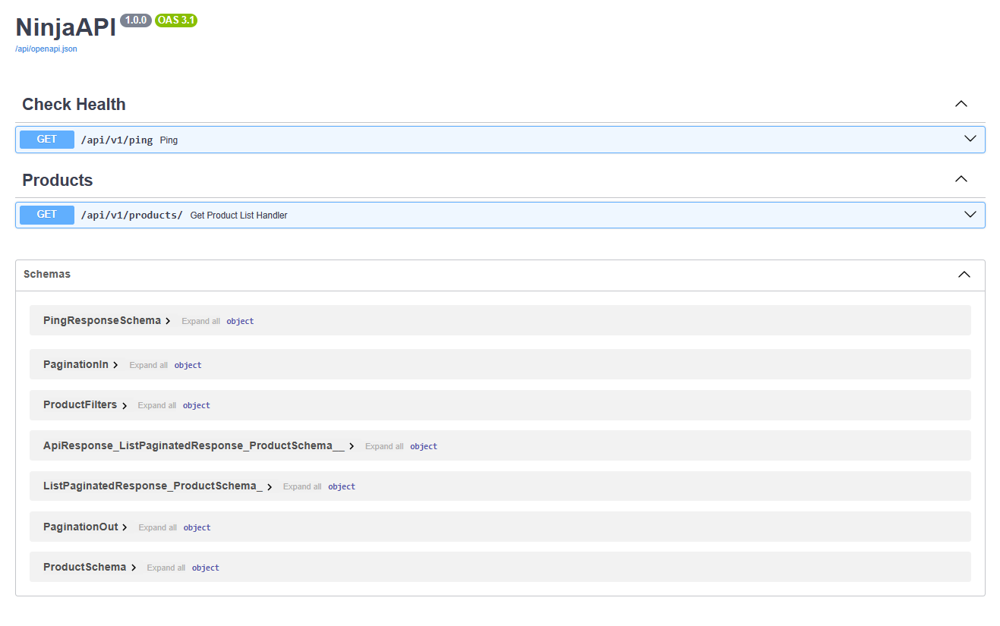

# Clean Architected Django Boilerplace (Marketplace)

This is ideal, clean and well-structured/architected Django Boilerplate and example using Django, Django Ninja, Postgres, Docker and Makefile

## Demonstration

### Django Ninja Swagger Docs of API endpoints



## Tech Stack

- Docker
- Makefile
- Django Ninja for REST API like FastAPI with Pydantic
- PostgreSQL
- Poetry

## TO DO

- [x] Docker Compose for separated PostgreSQL and Main-App with `.env` file
- [x] Implement Makefile commands to iteraction with Docker Compose
- [ ] Implement DDD architecture, Clean Architecture with applying Clean Code, SOLID principles and Patterns
- [ ] Write Unit Tests
- [ ] Elasticsearch APM and Kibana

## Architecture

Layers

1. API
2. Domain
3. Services
4. DTO + Repo
5. Others

---

## Requirements

- [Python](https://www.python.org/downloads/)
- [Poetry(Optional)](https://python-poetry.org/docs/#installation)
- [Docker](https://docs.docker.com/get-docker/)
- [GNU Make](https://www.gnu.org/software/make/#download) (install on windows using chocolatey package manager)

## How to Use

1. **Clone this repository**

```bash
git clone https://github.com/dotpep/clean-django-marketplace.git
cd clean-marketplace
```

2. Install all dependencies and required packages
3. Change `.env.example` file to `.env` with provided your environment variables

## Implemented Makefile Commands

### Docker specific commands

- `make app` - up django server container
- `make app-logs` - display logs of django server
- `make app-down` - down django server container
- `make storages` - up storages in separated container (then you can run django server locally)
- `make storages-logs` - display storages logs
- `make storages-down` - down storage container

---

- `make postgres` - enter to postgres db interactive shell mode (psql) to perform SQL queries
- `make postgres-db` - immediately go to project database interactive shell mode
- `make ash` - enter to interactive ash shell of project app

### Django specific commands

- `make migrations` - make migrations on models
- `make migrate` - apply all migrations
- `make superuser` - create admin user
- `make collectstatic` - collect all static files in project to base-dir static folder
